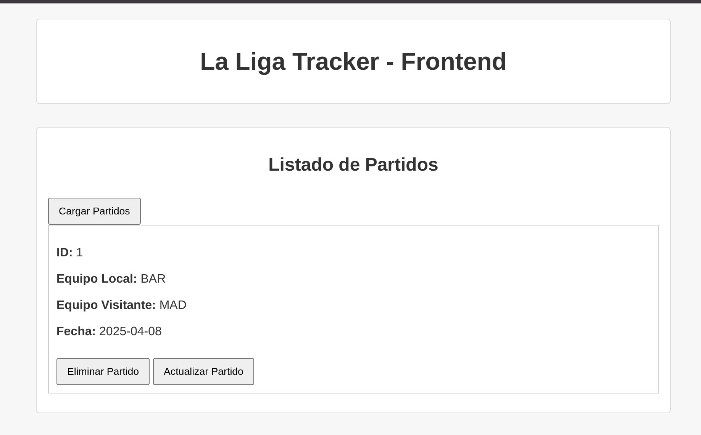

# 📊 LaLiga Tracker - Parte 1 (Backend + Frontend)

Este proyecto es un sistema de seguimiento de partidos de La Liga, desarrollado en Go (Golang) con una API REST y una interfaz web sencilla en HTML + JS.  
Permite crear, consultar, actualizar y eliminar partidos.

---

## 📁 Estructura del Proyecto

## 🖼️ Vista del Frontend funcionando

